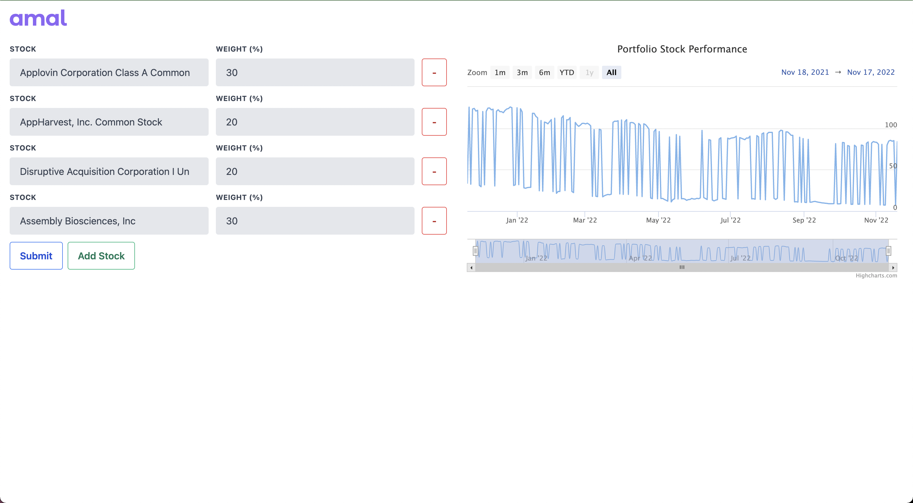

# Amalinvest performance tracker

It's a simple tool that allows a user to enter a list of up to 5 stocks and the % weight they’d like to assign to each stock. When the user submits this information, it displays a chart showing the overall performance of this group of stocks over the last 12 month period.

# How to setup and run the project
1. Clone the repo
2. `cd amalinvest-test`
3. install rush with `npm install -g @microsoft/rush`
4. install all dependencies with `rush update`
5. cd into packages/types `cd ../types` and run `rushx build`
6. cd into backend `../../backend` and add `.env` to the root of the folder. Add the polygon key here like so `POLYGON_KEY=s0HXZDL6c5Qyo9PCbwIrGlTT1NYiNBnJ`
7. run `rushx start:dev`
8. cd into frontend `../frontend` and run `rushx nextdev`
9. Open the url `http://localhost:3000` in the browser to test the project

# Final Thoughts:
1. ### Assumptions I made
- I decided to use the container pattern for the frontend where the watchlist index page is responsible for all the orchestration and side-effects. Relevant data is then passed down to the children components. Most components are dumb (Except the stock search input) for this purpose.
- I decided to use the Repository pattern for the backend where each service is responsible for 1 resource and the related business logic.
- I used a POST request for the "/stock/performance" endpoint cause this is where we would have ideally saved this information in our DB. It is debatable I guess :D 
- I didn't use any state management as this was a small project and all the state could be effectively handled by the container.

3. ### Things I could improve on
- A better error handler for the Frontend and Backend.

